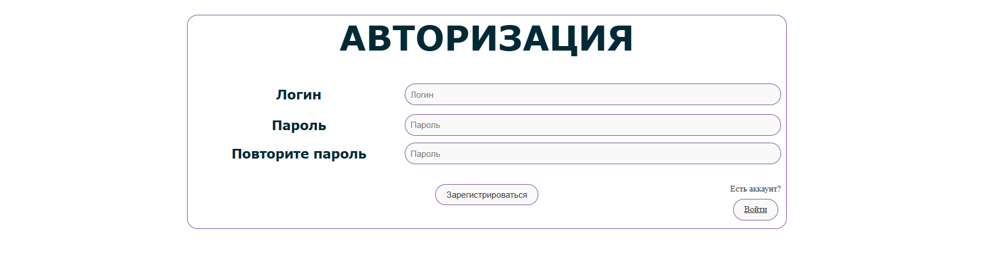

# List
Веб-приложение для удобного ведения списка прочитанных книг и просмотренных фильмов
## Стек
1. **Python 3.10**
2. **Django 5.1.4**
3. **python-decouple 3.8**
4. **requests 2.32.3**
5. **beautifulsoup4**
## Запуск проекта
Для запуска проекта на локальном сервере необходимо выполнить команду
```
python manage.py runserver
```
## Пример .env
```
SECRET_KEY=
DEBUG=
ALLOWED_HOSTS=
```
## Скриншоты
### Главный экран

### Выпадающий список каталогов

### Пример выбора каталога манга

### Пример работы формы на добавление записи

### Профиль

### Вход

### Регистрация



